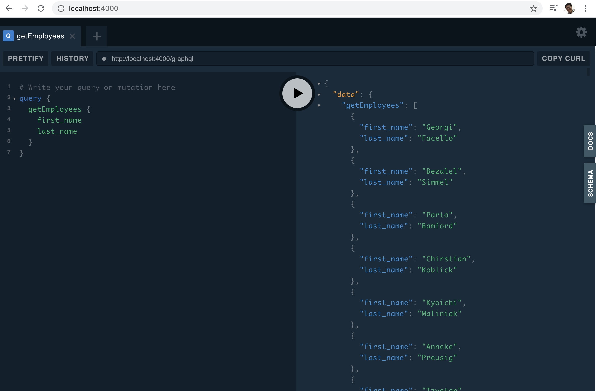

# GraphQL Mesh Docker

 on 

Simple docker image to run just a [GraphQL Mesh](https://github.com/Urigo/graphql-mesh) (Thank you [Urigo](https://github.com/Urigo) and Mesh community for developing nice tool!)

Please prepare only Docker environment and run the command. No need to understand Node.js.

- [GraphQL Mesh Docker](#graphql-mesh-docker)
- [TL;DR](#tldr)
- [Images for GraphQL Mesh](#images-for-graphql-mesh)
- [Run](#run)
  - [1. On Docker](#1-on-docker)
  - [2. On Kubernetes](#2-on-kubernetes)
- [Customize](#customize)
  - [Customize .meshrc](#customize-meshrc)
      - [On Docker](#on-docker)
      - [On Kubernetes](#on-kubernetes)
  - [Clone another existing example and run in Docker](#clone-another-existing-example-and-run-in-docker)
- [Example](#example)
  - [GraphQL Mesh with MySQL](#graphql-mesh-with-mysql)
- [Build on your own](#build-on-your-own)
# TL;DR

```sh
# Run on Docker
docker run --name mesh -p 4000:4000 -it --rm hiroyukiosaki/graphql-mesh:v0.1.10
```

And access to `http://localhost:4000`.

# Images for GraphQL Mesh

- [`graphql-mesh` on Dockerhub](https://hub.docker.com/repository/docker/hiroyukiosaki/graphql-mesh)
  - tag: `v0.1.10` ([Dockerfile](./Dockerfile))
    - Includes minimum CLI and handler ([`@graphql-mesh/openapi`](https://graphql-mesh.com/docs/handlers/openapi))
  - tag: `v0.1.10-all` ([Dockerfile-all](./Dockerfile))
    - Includes [all handlers](https://graphql-mesh.com/docs/handlers/available-handlers/)

# Run

You can choose step for your envionment (Docker or Kubernetes)

## 1. On Docker 

Simply run this command.

```sh
# Just docker run (choose tag version)
docker run --name mesh -p 4000:4000 -it --rm hiroyukiosaki/graphql-mesh:v0.1.10
docker run --name mesh -p 4000:4000 -it --rm hiroyukiosaki/graphql-mesh:v0.1.10-all
```

Alternatives

```sh
# docker-compose
docker-compose up -d
# or to run vX.X.X-all
docker-compose -f docker-compose-all.yaml up -d
```

After running docker image, you can access to GraphQL Mesh service at `http://localhost:4000` and you will see this screen. 

## 2. On Kubernetes

```sh
# If you want to change image, please edit k8s/pod.yaml
kubectl apply -f k8s/basic
# or
kubectl apply -f k8s/jsonschema-covid19
```

After the pod running, we can forward the kubernetes service port to local machine with this command and access to GraphQL Mesh at `http://localhost:4000`.

```
kubectl port-forward svc/mesh-svc 4000:4000 &
```

# Customize

There are two ways to customize GraphQL Mesh Docker.

- Customize `.meshrc.yaml`
- Clone an existing example and run in Docker

## Customize .meshrc

> [GraphQL Mesh Basic Usage](https://graphql-mesh.com/docs/getting-started/basic-example/)

- Please follow the guidance of the official document above and create your `.meshrc.yaml`.
- Place `.meshrc.yaml` in the directory.

  #### On Docker
  - Edit `docker-compose.yaml` file in order to point your `.meshrc.yaml`

  ```yaml
      volumes:
        - ./.meshrc.yaml:/work/.meshrc.yaml # <- comment out and ponit your .meshrc.yaml
  ```
  - Run `docker-compose up -d`

  #### On Kubernetes
  - **Overwrite** new ConfigMap resource file with this command.

  ```sh
  kubectl create cm meshrc-cm --from-file .meshrc.yaml --dry-run -o yaml> k8s/basic/meshrc-cm.yaml
  ```
  - Run `kubectl apply -f k8s/basic`

## Clone another existing example and run in Docker

```sh
# This clones example and creates a directory "covid-mesh"
git clone https://github.com/jycouet/covid-mesh

# Mount this directory into container and run.
docker run --name mesh -p 4000:4000 -v `pwd`/covid-mesh:/work -it --rm hiroyukiosaki/graphql-mesh:v0.1.10 /bin/bash -c 'yarn install && yarn start'
```

# Example

## GraphQL Mesh with MySQL

The following  use [mysql-employee](https://github.com/Urigo/graphql-mesh/tree/master/examples/mysql-employees) example.

Simpler docker-compose setup is [here](https://github.com/onelittlenightmusic/graphql-mesh-docker-mysql-example).

```sh
git clone https://github.com/datacharmer/test_db.git

# Run MySQL and restore employee db
docker run --name mysql -v `pwd`/test_db/:/test_db -e MYSQL_ROOT_PASSWORD=passwd -d -p 3306:3306 mysql --default-authentication-plugin=mysql_native_password
docker exec -it mysql /bin/bash
$ cd /test_db
$ mysql < employees.sql -p
# enter "passwd"

# This clones example
git clone https://github.com/Urigo/graphql-mesh.git

# Mount this directory into container and run.
docker run --name mesh -v `pwd`/graphql-mesh/examples/mysql-employees:/work -p 4000:4000 -d hiroyukiosaki/graphql-mesh:v0.1.10 /bin/bash -c 'sleep 3600'

# Edit .meshrc.yaml
# Point host address like this (in Mac)
#         host: host.docker.internal 

docker exec -it mesh /bin/bash
$ yarn install
$ yarn start
```

Access `http://localhost:4000`



<!---
### GraphQL Mesh with PostreSQL

**[] This example is not fully working.**

This commands use [postgres-geodb](https://github.com/Urigo/graphql-mesh/tree/master/examples/postgres-geodb) example.

```sh
curl -LO https://raw.githubusercontent.com/morenoh149/postgresDBSamples/master/worldDB-1.0/world.sql
docker run --name pg-docker -v `pwd`/world.sql:/world.sql -e POSTGRES_PASSWORD=docker -d -p 5432:5432 postgres
docker exec pg-docker psql -h localhost -d postgres -U postgres -f /world.sql

# This clones example
git clone https://github.com/Urigo/graphql-mesh.git

# Mount this directory into container and run.
[TBD]
```
--->

# Build on your own

We can utilize `docker-compose` command to build with Dockerfile

```sh
docker-compose build
```

